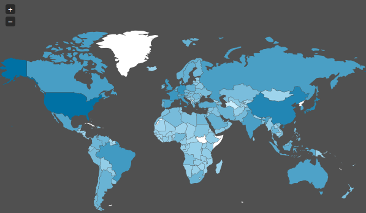

<div align="center">

</div>

> <p dir="RTL"> 
با استفاده از داده های زلزله ها در ایران و جهان به سوالات زیر پاسخ دهید.
</p>

<p dir="RTL">
توابع، دادهها و کتابخانههای زیر در طول تمرین مورد استفادهقرار میگیرند.
</p>

```{r, message=FALSE, warning=FALSE, comment=NA}
library(readr)
library(dplyr)
library(stringr)
library(ggmap)
library(highcharter)
library(plotly)
library(ggplot2)
library(rworldmap)
library(countrycode)
library(cowplot)
library(sp)
library(gganimate)
library(lubridate)

earthquakes = read_rds("data/historical_web_data_26112015.rds")

# convert coordinate to country
coords2country = function(points)
{  
  countriesSP = getMap(resolution='high')
  pointsSP = SpatialPoints(points, proj4string=CRS(proj4string(countriesSP)))  
  indices = over(pointsSP, countriesSP)
  indices$ISO3
}
```

***

<p dir="RTL">
۱. با استفاده از داده های
historical_web_data_26112015.rds 
و استفاده از نمودار پراکنش سه بعدی بسته plotly نمودار طول، عرض و عمق زلزله ها را رسم نمایید. علاوه بر آن بزرگی هر نقطه را برابر بزرگی زمین لرزه قرار دهید.
</p>
```{r, message = FALSE, comment = NA, warning = FALSE}
plot_ly(earthquakes,
        x = ~Longitude, y = ~Latitude, z = ~Depth, size = ~Magnitude,
        marker = list(color = ~Magnitude,
                      symbol = 'circle',
                      sizemode = 'diameter',
                      colorscale = c('#FFE8A8', '#884848'),
                      showscale = TRUE),
        sizes = c(0.8, 8.8),
        text = ~paste('Province: ', Province,
                      '<br>City: ', City,
                      '<br>Earthquake Magnitude: ', Magnitude)) %>%
  add_markers() %>%
  layout(scene = list(title = 'Iran Earthquakes',
                      xaxis = list(title = 'Longitude', range = c(40, 80)),
                      yaxis = list(title = 'Latitude', range = c(20, 40)),
                      zaxis = list(title = 'Depth', range = c(0, 180))))

```
***

<p dir="RTL">
۲. پویانمایی سونامی های تاریخی را بر حسب شدت بر روی نقشه زمین رسم نمایید.(از داده زلزله های بزرگ استفاده نمایید.)
</p>

```{r, message = FALSE, comment = NA, warning = FALSE}
disaster = read_delim("data/disaster.txt",
                      "\t",
                      trim_ws = TRUE) %>%
  select(lon = LONGITUDE,
         lat = LATITUDE, 
         mag = INTENSITY,
         dep = FOCAL_DEPTH,
         country = COUNTRY,
         year = YEAR,
         t_death = TOTAL_DEATHS) %>% 
  na.omit()

```

```{r, message = FALSE, comment = NA, warning = FALSE, eval = FALSE}
eq_an = ggplot() +
  borders("world", colour="black", fill="gray") +
  geom_point(aes(x = disaster$lon,
                 y = disaster$lat,
                 size = disaster$mag,
                 frame = disaster$mag),
             color="blue") +
  ggtitle("Earthquakes In The World") +
  xlab("Longitute") +
  ylab("Latitude")

gganimate(eq_an, "eq_an.gif")
```
<span>
  
</span>
***

<p dir="RTL">
۳. نمودار چگالی دو بعدی زلزله های تاریخی ایران را رسم کنید.( از داده iran_earthquake.rds و لایه stat_density_2d استفاده نمایید).
</p>

```{r, message = FALSE, comment = NA, warning = FALSE}
eq_ir = read_rds("data/iran_earthquake.rds") %>% 
  filter(Long < 70)

ggplot(eq_ir, aes(x=Long, y=Lat)) +
  geom_point() +
  stat_density_2d(aes(fill = ..level.., colour = ..level..), geom = "polygon") +
  ggtitle("IR Earthquakes Density") +
  xlab("Longitude") +
  ylab("Latitude")

```


***

<p dir="RTL">
۴. احتمال اینکه در ایران در پنج سال آینده زلزله به بزرگی هفت ریشتر رخ دهد را محاسبه کنید. (از احتمال شرطی استفاده کنید.)
</p>

<p dir="RTL">
برای این سوال احتمال اینکه در پنجسال آینده زلزله رخدهد به شرط آنکه بیشتر از ۷ ریشتر باشد را محاسبه میکنیم.
برای اینکار احتمال اینکه در پنجسال آینده یک زلزله رخدهد را بهشرط آنکه آن زلزله بزرگتر از ۷ ریشتر باشد را بایستی محاسبه کنیم.
در پنجسال آینده باتوجه به دادهها با احتمال ۱۰۰٪ زلزله رخخواهدداد پس بایستی فقط احتمال اینکه در پنج سال آینده زلزلهی به بزرگی بیشتر از ۷ ریشتر رخدهد را محاسبه کنیم.
</p>

```{r, message = FALSE, comment = NA, warning = FALSE}
eq_ir_7 = disaster %>% 
  filter(mag >= 7, country == 'IRAN') %>% 
  arrange(-year) %>% 
  mutate(dis = lag(year),
         dis = dis - year,
         dis = ifelse(is.na(dis),2018-year,dis))

eq_ir_7_under5 = eq_ir_7 %>% 
  mutate(uder5 = ifelse(dis <= 5, 1, 0)) %>% 
  group_by(uder5) %>% 
  summarise(count = n())

# +3 for continues < 5 years
prob = eq_ir_7_under5 %>% 
  summarise(prob =((7 + 3)/sum(count)))

knitr::kable(prob, 'html')
```


***

<p dir="RTL">
۵. بر اساس داده های زلزله های بزرگ ابتدا تعداد و متوسط کشته زلزله ها را بر حسب کشور استخراج نمایید. سپس نمودار گرمایی تعداد کشته ها را بر روی کره زمین رسم نمایید.(مانند مثال زیر!)
</p>

<div align="center">

</div>

```{r, message = FALSE, comment = NA, warning = FALSE}
disaster_country = disaster %>%
  group_by(country) %>%
  summarise(death_count = sum(as.integer(t_death)),death_mean = mean(as.integer(t_death))) %>%
  arrange(-death_count) %>% 
  mutate(country_code = countrycode(country,
                               "country.name",
                               "iso3c"))

knitr::kable(disaster_country %>% select(-country_code))

mapCountryData(joinCountryData2Map(disaster_country, nameJoinColumn = "country_code"),
               nameColumnToPlot = "death_count", 
               mapTitle="Earthquakes Total Death")

mapCountryData(joinCountryData2Map(disaster_country, nameJoinColumn = "country_code"),
               nameColumnToPlot = "death_mean", 
               mapTitle="Earthquakes Death Rate")
```


***

<p dir="RTL">
۶. با استفاده از داده لرزه های بزرگ و به وسیله طول، عرض، شدت، عمق مدلی برای پیش بینی تعداد کشته های زلزله بیابید.
</p>

<p dir="RTL">
مدل
glm
را باتوجه به نوع دادهها با خانوادهی گاما ایجادمیکنیم و آن را ارزیابی میکنیم و درمییابیم که به عمق و شدت آن بستگی دارد و مکان آن اهمیتی در مدل ندارد پس مدل جدید را براین مبنا مدلسازی میکنیم و ارزیابی میکنیم که نتیجهی قابل قبولی به دست میدهد.
</p>

```{r, message = FALSE, comment = NA, warning = FALSE}
eq_glm = glm(t_death ~ mag + dep + lat + lon, family = Gamma(link = "inverse"), data = disaster)
summary(eq_glm)

eq_glm = glm(t_death ~ mag + dep, family = Gamma(link = "inverse"), data = disaster)
summary(eq_glm)
```


***

<p dir="RTL">
۷. با استفاده از داده worldwide.csv به چند سوال زیر پاسخ دهید. تحقیق کنید آیا می توان از پیش لرزه، زلزله اصلی را پیش بینی کرد؟
</p>

<p dir="RTL">
از روی دادهها پیشلرزهها را استخراجکرده و روی آنها تعداد و میانگین آنها و قدرت زلزلهی اصلی را درکنار هم جمعکرده و مدلی را استخراج میکنیم که این پیشبینی را صورت دهد که خروجی آن نتیجهی قابل قبولی را گزارش میکند.
</p>

```{r, message = FALSE, comment = NA, warning = FALSE}
worldwide = read_csv("data/worldwide.csv")

worldwide = worldwide %>%
  mutate(year = year(time),
         month = month(time), 
         day = day(time),
         location = as.data.frame(str_split_fixed(place, ',',2))$V2,
         location = ifelse(location == '' , as.character(place), as.character(location))) %>% 
  select(time, year, month, day, latitude, longitude, depth, mag, location) %>% 
  group_by(year, month, location) %>%
  arrange(time) %>% 
  mutate(mag_max = max(mag))
worldwide$groupid = worldwide %>% group_indices(year, month, location)

worldwide_temp = worldwide %>% 
  filter(mag == mag_max) %>% 
  ungroup() %>% 
  select(groupid,time_max = time)

worldwide = merge(worldwide, worldwide_temp)

worldwide = worldwide %>% 
  mutate(pre_past = ifelse(time > time_max, 'pre',ifelse(time == time_max, 'eq', 'past')))

worldwide_pred = worldwide %>% 
  filter(pre_past == 'pre' | pre_past == 'eq') %>% 
  ungroup() %>% 
  select(groupid, mag, pre_past) %>% 
  group_by(groupid,pre_past) %>% 
  summarise(avg_mag = mean(mag), count = n()) %>% 
  ungroup()

wwpm = worldwide_pred %>% 
  filter(pre_past == 'pre') %>% 
  select(groupid, count, avg_mag)

wwpmm = worldwide_pred %>% 
  filter(pre_past == 'eq') %>% 
  select(groupid, main = avg_mag)

x = merge(wwpm,wwpmm) %>% 
  select(-groupid)

glm_eq_pred = glm(count~., data = x)
summary(glm_eq_pred)
```

***

<p dir="RTL">
۸. گزاره " آیا شدت زلزله به عمق آن بستگی دارد" را تحقیق کنید؟ (طبیعتا از آزمون فرض باید استفاده کنید.)
</p>

```{r, message=FALSE, warning=FALSE, comment=NA}
cor.test(worldwide$depth, worldwide$mag, method = 'spearman')

mat_eq = as.matrix(worldwide %>%
                     select(depth, mag) %>% 
                     mutate(depth = depth + abs(min(depth)))
                   ) 

chisq.test(mat_eq)
```
<p dir="RTL">
تست وابستگی بیان میکند که غیرمرتبط بودن این دو متغیر از یکدیگر رد میشود پس میتوان نتیجهگرفت که بین آنها ارتباط وجود دارد و تست استقلال نیز بیان میکند که این دو متغیر نیز مستقل بودنشان از هم رد میشود و وابستگی آنها نیز تایید میشود.
پس فرض مستقل بودن این دو متغیر از هم رد میشود.
</p>
***

<p dir="RTL"> 
۹. میانگین سالانه زلزله ها را بر حسب کشور به دست آورید. آیا میتوان دلیلی در تایید یا رد تئوری هارپ ارائه کرد.
</p>

```{r, message=FALSE, warning=FALSE, comment=NA}
long_lat = worldwide %>%
  select(longitude, latitude)
long_lat$country = coords2country(long_lat)

worldwide$country_code = long_lat$country

country_code = worldwide %>% 
  ungroup() %>% 
  group_by(location) %>% 
  select(location, country_code) %>% 
  na.omit() %>% 
  distinct(country_code, location) %>% 
  ungroup() %>% 
  select(location, c_code = country_code) %>% 
  group_by(location) %>% 
  slice(1) %>% 
  ungroup()

worldwide_fixed_country_code = merge(worldwide, country_code)
worldwide_fixed_country_code = worldwide_fixed_country_code %>% 
  mutate(c_code = ifelse(!is.na(country_code),
                         as.character(country_code),
                         as.character(c_code)
                         ),
         country_code = c_code
         ) %>% 
  select(-c_code)

worldwide = worldwide_fixed_country_code

worldwide_accu = worldwide %>%
  group_by(year, country_code) %>% 
  summarise(eq_count = n(),
            mean_mag = mean(mag),
            mean_dep = mean(depth))

eq_2015 = worldwide_accu %>%
  filter(year == 2015) %>% 
  select(eq_count)

eq_2016 = worldwide_accu %>%
  filter(year == 2016) %>% 
  select(eq_count)
                    
eq_2017 = worldwide_accu %>%
  filter(year == 2017) %>% 
  select(eq_count)
                   
eq_2018 = worldwide_accu %>%
  filter(year == 2018) %>% 
  select(eq_count)

t.test(eq_2015$eq_count,eq_2016$eq_count)
t.test(eq_2015$eq_count,eq_2017$eq_count)
t.test(eq_2015$eq_count,eq_2018$eq_count)
```
<p dir="RTL"> 
با توجه به اینکه پروژهی هارپ در سال ۲۰۱۵ متوقف شد زلزلههای این سال را با سالهای بعدی آن مقایسهکردم و تست
t 
را بر روی آنها اجرا کردم تا تفاوت این سالها را باهم مقایسه کنم.
نتایج این تست نشانداد که این سالها بایکدیگر تفاوت معناداری ندارند و این تئوری را میتوان رد کرد.
</p>

***

<p dir="RTL"> 
۱۰. سه حقیقت جالب در مورد زلزله بیابید.
</p>

<p dir="RTL"> 
۱۰.۱. نمودار جعبهای زلزلهها در سالها و جایگاه ایران در آن
</p>

```{r, message=FALSE, warning=FALSE, comment=NA}
ww_mag_year = worldwide %>% 
  group_by(year, country_code) %>% 
  summarise(mean_mag = mean(mag)) %>% 
  select(year, mean_mag) %>% 
  ungroup()

iran_w = worldwide %>% 
  group_by(year, country_code) %>% 
  summarise(mean_mag = mean(mag)) %>% 
  filter(country_code == 'IRN') %>% 
  select(year, mean_mag) %>% 
  ungroup()
  
ggplot(ww_mag_year,aes(x = year, y = mean_mag, group = year)) +
  geom_boxplot() +
  geom_line(data = iran_w,aes(x = year, y = mean_mag, group = 1, color = 'Iran'), size = 1.5) + 
  ggtitle("Average Earthquake Magnitude In Worldwide") + 
  ylab("Magnitude Mean") +
  xlab("Year")
```
<p dir="RTL"> 
۱۰.۲. ده زلزلهخیزترین کشورها
</p>

```{r, message=FALSE, warning=FALSE, comment=NA}
country_reg = country_code %>% 
  group_by(c_code) %>% 
  summarise(reg_num = n()) %>% 
  ungroup() %>% 
  select(country_code = c_code, reg_num)

ww_mag_count = worldwide %>% 
  group_by(country_code) %>% 
  summarise(mean_mag = mean(mag), count = n()) 

ww_mag_count = merge(ww_mag_count, country_reg)

top_10 = ww_mag_count %>% 
  mutate(score = (count*mean_mag)/reg_num) %>% 
  arrange(-score) %>% 
  slice(1:10)

knitr::kable(top_10, "html")
```

<p dir="RTL"> 
۱۰.۳. نحسی عدد ۱۳ در وقوع زلزله در روز ۱۳ام.
</p>

```{r, message=FALSE, warning=FALSE, comment=NA}
thirteen = worldwide %>% 
  filter(day == 13)

not_thirteen = worldwide %>% 
  filter(day != 13)

t.test(thirteen$mag, not_thirteen$mag, alternative = "greater")
```

<p dir="RTL"> 
این تست رد میشود و نمیتوان نتیجهگرفت که روز ۱۳ام روز نحسی برای زلزله است.
</p>